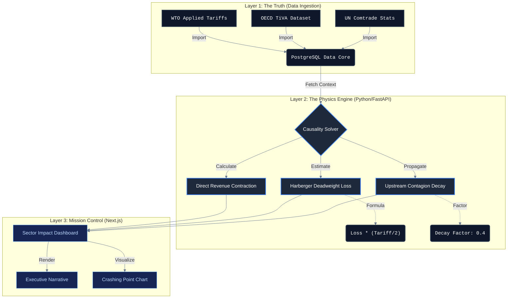

# TIPM | Trade & Industrial Impact Propagation Model (v1.0)

**Strategic Decision Intelligence for the Decoupling Era.**

---

## 🏛️ Project Overview

In an era of rising geoeconomic fragmentation, the **Trade & Industrial Impact Propagation Model (TIPM)** serves as a mission-critical "Stress Test" environment for sovereign industrial policy. This project is not a static database; it is a **Deterministic Causality Engine** designed to quantify the systemic shocks of trade intervention across global supply chains.

By leveraging **Multi-Regional Input-Output (MRIO)** logic, TIPM moves beyond gross trade stats to "Value Added" metrics, allowing policy architects to visualize the recursive ripple effects—upstream, downstream, and domestic—of a single tariff shock.

---

## 💎 Value Proposition: Clarity through Causality

Standard trade models often ignore the embedded value of third-party nations in bilateral flows. TIPM solves this by providing a **deterministic causality engine** that allows policy architects to visualize the recursive ripple effects—upstream, downstream, and domestic—of a single tariff shock.

- **High-Fidelity Granularity**: 190+ Economies | 45+ Industrial Sectors.
- **Dynamic Baselines**: Anchored in real-time WTO Applied Tariffs and OECD TiVA 2024 datasets.
- **Narrative AI**: Automated generation of qualitative causal reasoning for executive briefings.

---

### System Architecture



### Core Simulation Pillars

1. **Direct Revenue Contraction**: Real-time modeling of export volume decay in targeted sectors.
2. **Upstream Contagion Decay**: Recursive trace of value-added loss for intermediate resource providers (Decay Factor: 0.4).
3. **Domestic Inflationary Blowback**: Quantification of deadweight loss (Harberger Triangle) and consumer price spikes.
4. **Strategic Retaliation Matrix**: Predictive modeling of secondary policy responses.

### Technology Stack (Enterprise Grade)

- **Engine Layer**: Python 3.11 / FastAPI | High-performance deterministic simulation solver.
- **UI Logic Layer**: Next.js 14 / TypeScript | Interactive "Mission Control" visualization suite.
- **Persistence Layer**: PostgreSQL + Prisma | Unified Trade Matrix and Economy Profiles.
- **Orchestration**: Docker-Native architecture for frictionless deployment in private cloud/NAS environments.

---

## 🚦 Deployment & Governance

### Rapid Start

```bash
docker-compose up -d --build
```

Access the **TIPM Frontend** portal at `http://localhost:3008`.

### Operational Ports

| Service                 | External Port | Internal Port |
| ----------------------- | ------------- | ------------- |
| **TIPM Frontend**       | 3008          | 3000          |
| **TIPM Engine**         | 3009          | 8000          |
| **TIPM Data Core (DB)** | 5436          | 5432          |

---

## 📈 Roadmap & Strategic Evolution

- [x] **v0.6**: Implementation of Sectoral Granularity (ISIC Level 2).
- [x] **v1.0**: Macro-Scale Expansion (190+ Economies) & WTO Baseline Integration.
- [ ] **v1.1 (Upcoming)**: GenAI-Integrated Scenario Forecasts & Live Currency Volatility Overlay.

---

**This tool is created to demonstrate the power of AI in policy analysis.**

```python
Disclaimer: This model is an educational simulation designed to demonstrate algorithmic impact propagation. It utilizes static WTO/OECD datasets and standard economic approximations (Harberger/Leontief) for architectural demonstration purposes. It is not intended for real-time financial forecasting or sovereign policy advisory.
```

TIPM was developed using Antigravity and Gemini 3.

For collaboration, feedback, or suggestions, reach out to me at <tgb_dev@thegeekybeng.com> . Follow me on github or X @thegeekybeng.
